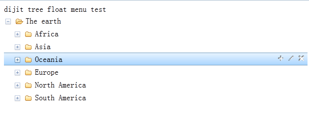

# dijit Tree 浮动菜单

使用dijit树控件时，对于额外的操作一般都会以添加右键菜单的方式来完成。但是对于用户而言，如果没有特别的提示，就有可能不知道该控件是否提供了右键操作菜单，所以，添加浮动菜单对用户体验而言是有一定增进效果的。

## 用法

+ 引入css

		<link rel="stylesheet" type="text/css" href="../treeFloatMenu.css">

+ 引入js文件。(*我使用的dojo1.7，并且使用AMD规范定义treeFloatMenu.js扩展模块*)

		require(["dojo/ready", "dojo/_base/window", "dojo/store/Memory", 
				"dijit/tree/ObjectStoreModel", "dijit/Tree", "treeFloatMenu"],
		 		function(ready, win, Memory, ObjectStoreModel, Tree){...})

+ 调用扩展方法显示菜单并添加菜单操作项。*(tree为实例化后的Tree控件)*

	 	tree.floatMenu([{
	        node: '',
	        onClick: function(event){
	            console.log(event.floatNode);
	            console.log(event.tree);            
	            var name = event.floatNode.item.name;
	            alert(name);
	        },
	        onTreeNodeMouseOver: function(event){
	            var type = event.floatNode.item.type;
	            if (type == 'planet') {
	                event.floatItem.style.display = "none";
	            }
	            else {
	                event.floatItem.style.display = "inline-block";
	            }
	        }
	    }]);

## api说明

### tree.floatMenu()

传入菜单操作项对象(floatItem，例如上面语句中的删除节点项)或对象数组。

### floatItem

+ node:操作项dom节点对象或html字符串。
+ onClick:操作项点击事件，通过`event.floatNode`获得浮动菜单所在的当前树节点;通过`event.tree`获取当前树控件。
+ onTreeNodeMouseOver:树节点鼠标移入事件，`event.floatNode`,`event.tree`同上，通过`event.floatItem`获得当前操作项dom节点(例如上面语句中的删除节点项)。例如，在示例中利用这个回调来控制操作项根据条件显示或隐藏。

**整个示例可以查看example目录下的index.html页面**
